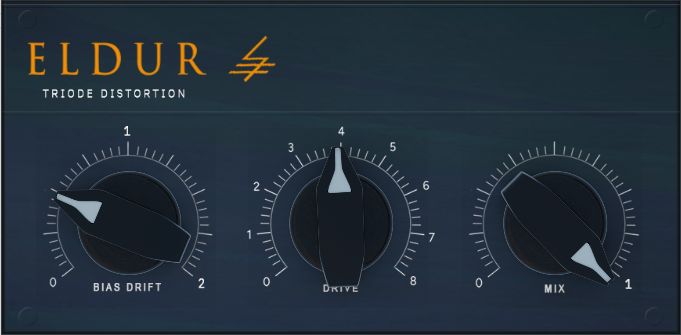

# Eldur – Koren’s Triode Tube Distortion VST

  

## Overview
**Eldur** is a CPU-intensive, tube-inspired distortion plugin based on Koren’s Triode Model. It aims to deliver an authentic, creamy saturation reminiscent of real tube circuitry, while offering a few unique parameters to shape the tone—such as Bias Drift, Drive, and a Mix control for easy parallel processing.

Whether you want subtle harmonic warmth or all-out valve crunch, Eldur provides a straightforward interface and minimal footprint (other than its appetite for CPU!). Perfect for experimenters, gearheads, or anyone curious about tube modeling.

## Key Features
- **Koren’s Triode Model**: Provides realistic non-linear behavior and classic tube breakup.  
- **Bias Drift Control**: Adjusts the simulated “tube drift” over time for more organic movement in the sound.  
- **Drive Knob**: Dial in everything from gentle saturation to hefty distortion.  
- **Mix Control**: Blend dry and wet signals for parallel processing.  

## CPU Usage & Disclaimer
- Eldur is **CPU-heavy** and currently optimized for one specific machine. My machine. Doesn't get more "Works on my machine" than that.
- Use it at your own risk—if it brings your DAW to its knees, well, at least you’ll know it’s doing some serious math.  
- Feedback and pull requests for optimizations or improvements are always welcome!

## Download
- **[Download the latest .vst3 build here](Eldur.vst3)**  

## How to Install
1. Copy the `.vst3` file to your VST3 plugins folder (commonly located in `C:\Program Files\Common Files\VST3` on Windows or `Library/Audio/Plug-Ins/VST3` on macOS).
2. Rescan or restart your DAW.
3. Insert **Eldur** on an audio track and tweak away!

## Contributing
Feel free to open issues or submit pull requests if you have ideas, performance fixes, or feature suggestions. Any form of contribution is welcome!

---
© 2025 YourName – Licensed under [MIT License](LICENSE).
